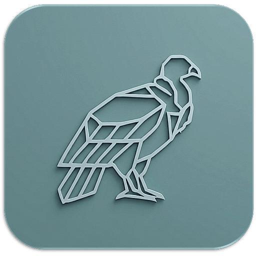
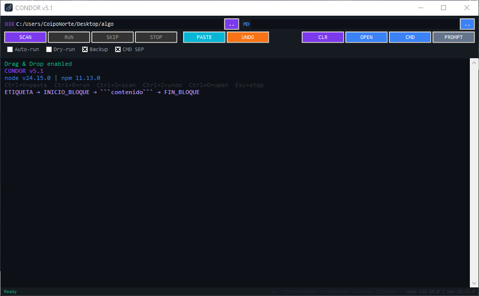

# 🦅 Kondor



**Kondor** es un automatizador de proyectos que lee instrucciones desde archivos `.md` y las ejecuta automáticamente. Crea archivos, modifica código, ejecuta comandos en terminal y construye proyectos completos sin abrir un editor. El puente perfecto entre tu IA favorita y tu proyecto real.

---

## 📸 Vista Previa

<p align="center">
  
</p>

*Interfaz oscura con sidebar de archivos, log en tiempo real y controles de ejecución.*

---

## ✨ Características Principales

* **Parser Inteligente:** Lee bloques `ETIQUETA[...] → INICIO_BLOQUE → contenido → FIN_BLOQUE` desde cualquier `.md` o texto pegado.
* **5 Acciones Automáticas:**
    * `CREAR` → Archivos nuevos con contenido completo.
    * `MODIFICAR` → Sobrescribe archivos existentes.
    * `EJECUTAR` → Comandos CMD con ventana separada opcional.
    * `ELIMINAR` → Borra archivos del proyecto.
    * `REEMPLAZAR` → Cambia líneas específicas dentro de archivos.
* **PASTE Directo:** Copia la respuesta de tu IA y pégala con `Ctrl+V`. Sin guardar archivos intermedios.
* **Editor Inline:** Doble clic en cualquier instrucción para editarla antes de ejecutar.
* **Sidebar de Archivos:** Árbol visual del proyecto con iconos por tipo de archivo. Botón 📋 para copiar la estructura al portapapeles.
* **Scripts Runner:** Lee `package.json` y muestra un menú con todos los scripts disponibles para ejecutar en CMD separada.
* **CMD SEP:** Cada comando npm/npx se abre en su propia ventana CMD con título descriptivo.
* **Backup + Undo:** Guarda copias de archivos antes de modificarlos. `Ctrl+Z` para restaurar.
* **Dry-run:** Simula la ejecución sin hacer cambios reales.
* **Bandeja del Sistema:** Minimiza a la bandeja de Windows con la X. Menú contextual para restaurar o cerrar.
* **Drag & Drop:** Arrastra carpetas para abrir como proyecto o archivos `.md`/`.txt` para procesarlos.
* **PROMPT + Mini-P:** Botones para copiar instrucciones de formato a tu IA. El botón `P` en la barra de estado copia una versión compacta.
* **Normalización Automática:** Convierte `npm create vite` a `npx create-vite --yes` para evitar preguntas interactivas.
* **SKIP / STOP:** Mata procesos en tiempo real durante la ejecución.

---

## 🛠️ Stack Tecnológico

Kondor está construido con tecnologías ligeras y portables:

* **Lenguaje:** Python 3.10+
* **Interfaz:** Tkinter + ttk
* **Bandeja:** pystray + Pillow
* **Drag & Drop:** tkinterdnd2
* **Distribución:** PyInstaller → `.exe` standalone

---

## 🚀 Cómo empezar

1. **Instalar dependencias:**
   ```bash
   pip install pystray pillow tkinterdnd2
   ```

2. **Ejecutar en modo desarrollo:**
   ```bash
   python condor.py
   ```

3. **Compilar para producción (Windows):**
   ```bash
   pyinstaller kondor.spec
   ```
   El ejecutable queda en `dist/KONDOR.exe`

---

## 🔄 Flujo de trabajo

```
1. Abre Kondor y selecciona la carpeta del proyecto en DIR
2. Presiona PROMPT para copiar las instrucciones del formato
3. Pega las instrucciones al inicio de tu chat con la IA
4. Pídele a la IA lo que necesitas
5. Copia la respuesta completa (Ctrl+A → Ctrl+C)
6. En Kondor presiona PASTE (Ctrl+V)
7. Revisa las instrucciones → doble clic para editar si necesitas
8. Presiona RUN
9. Kondor hace todo solo 🦅
```

---

## ⌨️ Atajos de Teclado

| Atajo | Acción |
|-------|--------|
| `Ctrl+V` | Pegar .md desde portapapeles |
| `Ctrl+R` | Ejecutar instrucciones |
| `Ctrl+S` | Analizar .md |
| `Ctrl+Z` | Deshacer último cambio |
| `Ctrl+O` | Abrir explorador de archivos |
| `Esc` | Detener ejecución |

---

## ☑️ Opciones

| Checkbox | Función |
|----------|---------|
| Auto-run | Ejecuta automáticamente después de analizar |
| Dry-run | Simula sin hacer cambios reales |
| Backup | Guarda copia antes de modificar archivos |
| CMD SEP | npm/npx/python/node se abren en ventana CMD separada |

---

## 📂 Estructura del Proyecto

```text
├── core/
│   ├── __init__.py
│   ├── cmd.py         # Ejecución de comandos CMD
│   ├── config.py      # Constantes y configuración
│   ├── executor.py    # Motor de ejecución de instrucciones
│   ├── files.py       # Crear, eliminar, reemplazar, backup
│   ├── parser.py      # Extractor de ETIQUETA/INICIO/FIN
│   └── process.py     # Manejo de procesos activos
├── ui/
│   ├── __init__.py
│   ├── app.py         # Clase principal AutoBuilder
│   ├── editor.py      # Editor de instrucciones (doble clic)
│   ├── scripts.py     # Menú de scripts package.json
│   ├── sidebar.py     # Árbol de archivos + copiar estructura
│   ├── statusbar.py   # Barra inferior + botón P
│   ├── styles.py      # Estilos ttk + tags del log
│   └── toolbar.py     # Botones y checkboxes
├── assets/
│   ├── icon.ico       # Icono de la aplicación
│   └── view.png       # Captura de pantalla
├── condor.ico         # Icono (favicon, barra, bandeja, .exe)
├── condor.py          # Entry point
├── prompt.txt         # Instrucciones completas para la IA
├── minip.txt          # Mini prompt compacto
├── kondor.spec        # Configuración de PyInstaller
└── README.md          # Este archivo
```

---

## 👤 Autor

Desarrollado con ❤️ en Chile por **CoipoNorte**.
> "Un poquito del sure en el norte de Chile"

---

## 📄 Licencia

Este proyecto es de uso privado para CoipoNorte. Úsalo bajo tu responsabilidad.
